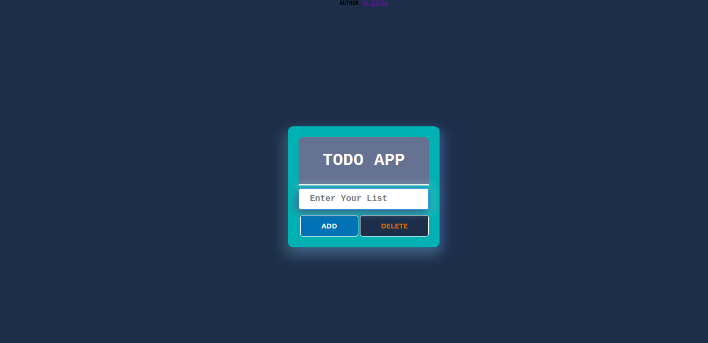

# TODO App

## Table of Contents

- [Table of Contents](#table-of-contents)
- [Introduction](#introduction)
- [View Live](#view-live)
- [Screenshot](#screenshot)
- [Features](#features)
- [Built With](#built-with)
- [How To Use](#how-to-use)
- [Clone and Installation](#clone-and-installation)
- [Credit](#credit)
- [Contact](#contact)

## Introduction

### The simple TODO app .It’s a list of tasks you need to complete or things that you want to do. 

## Live Preview

> ### [View Live](https://shviper.github.io/todo-app/)

# Screenshot




## Features

- `Add` todo
- `Complete` TODO
- `Multiple` Select and Deselect Action
- `Delete` TODO

## Built With

- `HTML`
- `CSS`
- `Javascript`

## `How To Use`

To clone and run this application, you'll need [Git](https://git-scm.com) installed on your computer. From your command line:

## `Clone and Installation`

```bash
git clone https://github.com/shviper/todo-app.git
cd ./todo-app
```

##### then open `index.html` file

## Credit

[Sajjad Hasan Riyad](https://www.facebook.com/shviper)

## Contact

- ` GitHub` [@shviper](https://www.github.com/shviper)
- `Twitter `[@trshviper](https://www.twitter.com/trshviper)
